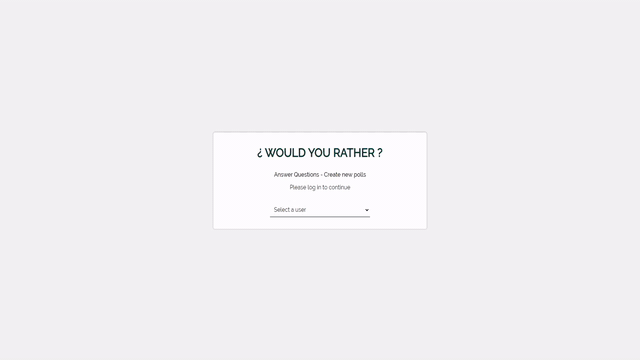

# Would You Rather
---



## Project Overview

Would you rather project is part of React Nanodegree Program by Udacity. It's single page application that allows users to answer to polls and create the new ones. 

This project was bootstrapped with [Create React App](https://github.com/facebookincubator/create-react-app).

## How to run project?

### Run on local machine

1. Clone repository to local machine using
```
$ git clone https://github.com/annaszalkiewicz/would-you-rather
```

2. Install all dependencies
```
$ npm install
```
3. Run application
```
$ npm start
```
visit the site: `http://localhost:3000`

## Offline usage

This project use service workers and cache its content. Set up your favorite HTTP server so that a visitor to your site is served index.html, and requests to static paths like /static/js/main.<hash>.js are served with the contents of the /static/js/main.<hash>.js file. Service worker runs only on production `build` directory. If you would like to test it on your local machine, please follow this guide: 

1. Make sure you have installed [Node](https://nodejs.org/).

2. Create `build` folder
```
$ npm run build
```

3. Install [Serve](https://github.com/zeit/serve).
```
$ npm install -g serve
```
4. Serve your static site on the port 5000. 
```
$ npm run serve
```
Like many of serve’s internal settings, the port can be adjusted using the `-p` or `--port` flags.

5. Open project on local server `localhost:5000`

## Dependencies

* [React](https://reactjs.org/)
* [React DOM](https://www.npmjs.com/package/react-dom)
* [React Router DOM](https://github.com/ReactTraining/react-router)
* [Redux](http://redux.js.org/)
* [React Redux](https://github.com/reduxjs/react-redux)
* [Redux Thunk](https://github.com/reduxjs/redux-thunk)
* [React Modal](https://www.npmjs.com/package/react-modal)
* [React Tabs](https://github.com/reactjs/react-tabs)
* [Node Sass ](https://github.com/sass/node-sass)
* [Font Raleway on Google](https://fonts.google.com/specimen/Raleway)
* [Material Design Icons](https://github.com/Templarian/MaterialDesign-JS)

## Contributions

As this project is part of React Nanodegree Program no contribution will be accepted.